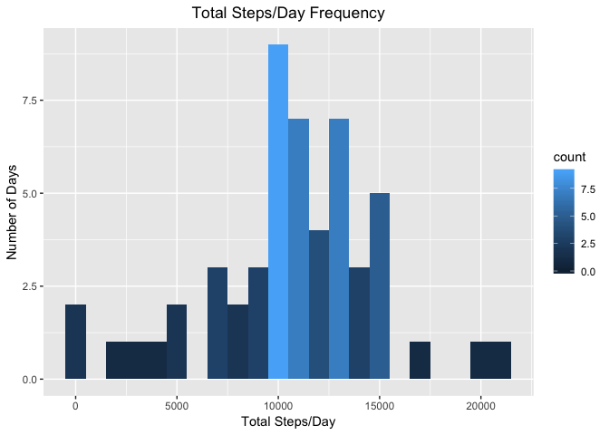
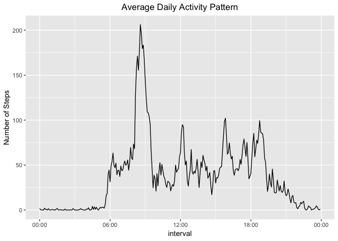
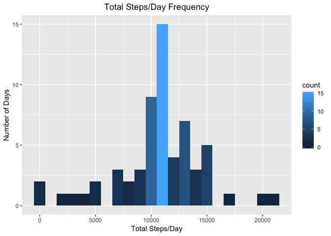
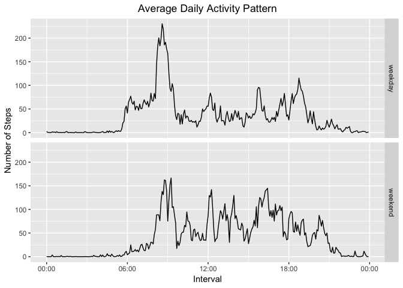

## Loading and preprocessing the data

Here we load the file, unzip the file, and read the file into a dataframe. This produces a dataframe with columns *steps*, *date*, and *interval*.

```r
# Zip file name
zfile <- "activity.zip"

# Unzip file
ufile <- unzip(zfile)

# Read unzipped file to dataframe
df <- read.csv(ufile, sep = ',', stringsAsFactors = FALSE, header = TRUE)
```

We summarize the data to understand its contents.

```r
# Summarize the data
summary(df)
```

```
##      steps            date              interval     
##  Min.   :  0.00   Length:17568       Min.   :   0.0  
##  1st Qu.:  0.00   Class :character   1st Qu.: 588.8  
##  Median :  0.00   Mode  :character   Median :1177.5  
##  Mean   : 37.38                      Mean   :1177.5  
##  3rd Qu.: 12.00                      3rd Qu.:1766.2  
##  Max.   :806.00                      Max.   :2355.0  
##  NA's   :2304
```

There are 17568 observations and 2304 missing step values in this dataset.

We then transform the date and intervals formats.

```r
# Dates from characters to date objects
df$new_date <- as.Date(df$date)

# Format intervals to 4 characters
df$new_interval <- sprintf("%04d", df$interval)

# Format intervals to hours and minutes (uses current day and local time by default)
df$new_time <- strptime(df$new_interval, format = "%H%M", tz = "UTC")
head(df)
```

```
##   steps       date interval   new_date new_interval            new_time
## 1    NA 2012-10-01        0 2012-10-01         0000 2019-05-06 00:00:00
## 2    NA 2012-10-01        5 2012-10-01         0005 2019-05-06 00:05:00
## 3    NA 2012-10-01       10 2012-10-01         0010 2019-05-06 00:10:00
## 4    NA 2012-10-01       15 2012-10-01         0015 2019-05-06 00:15:00
## 5    NA 2012-10-01       20 2012-10-01         0020 2019-05-06 00:20:00
## 6    NA 2012-10-01       25 2012-10-01         0025 2019-05-06 00:25:00
```


## What is mean total number of steps taken per day?

We first calculate the daily steps.

```r
# Split data by day
sdate <- split(df, df$new_date)

# Summarize daily steps
tsteps <- sapply(sdate, function(x) sum(x$steps))
```

We then graph the daily counts with a histogram to see daily trends.

```r
library(ggplot2)
qplot(tsteps, geom = "histogram", binwidth = 1000, fill = ..count.., xlab = "Total Steps/Day", ylab = "Number of Days", main = "Total Steps/Day Frequency") + theme(plot.title = element_text(hjust = 0.5))
```

```
## Warning: Removed 8 rows containing non-finite values (stat_bin).
```

<!-- -->

To understand daily averages, we calculate the mean and median daily steps.

```r
# Calculate the mean daily steps
mean(tsteps, na.rm = TRUE)
```

```
## [1] 10766.19
```

```r
# Calculate the median daily steps
median(tsteps, na.rm = TRUE)
```

```
## [1] 10765
```

There isn't a large difference between the mean and median daily steps with the missing values removed. We can infer that there isn't a large variation in the data.

## What is the average daily activity pattern?

First, we make a time series plot of the 5-minute intervals and the average number of steps taken, averaged across all days.

```r
library(scales)
# Split the dataframe into intervals
s_interval <- split(df, df$new_interval)

# Average the steps per interval
avg_steps <- sapply(s_interval, function(x) mean(x$steps, na.rm = TRUE))
# Create a new daily pattern dataframe (288 5-minute periods in one day)
day_pattern <- data.frame(time = df$new_time[1:288], ave_steps = avg_steps)
head(day_pattern)
```

```
##                     time ave_steps
## 0000 2019-05-06 00:00:00 1.7169811
## 0005 2019-05-06 00:05:00 0.3396226
## 0010 2019-05-06 00:10:00 0.1320755
## 0015 2019-05-06 00:15:00 0.1509434
## 0020 2019-05-06 00:20:00 0.0754717
## 0025 2019-05-06 00:25:00 2.0943396
```

```r
# Plot the daily pattern dataframe
ggplot(day_pattern, aes(x = time, y = ave_steps)) + geom_line() + 
labs(x = "interval", y = "Number of Steps", title = "Average Daily Activity Pattern") + scale_x_datetime(labels = date_format("%H:%M")) + theme(plot.title = element_text(hjust = 0.5))
```

<!-- -->

Then, we determine which 5-minute interval, on average across all the days in the dataset, contains the maximum number of steps

```r
# Determine the index of maximum average interval value
max_index <- which(avg_steps == max(avg_steps))

# Determine the value of the index
max_interval <- df$new_interval[max_index]

# Display the index value
max_interval
```

```
## [1] "0835"
```

The most active interval of 08:35 matches the Average Daily Activity Pattern visualization.

## Imputing missing values

Calculate and report the total number of missing values in the dataset

```r
# Identify if value is NA
na_vals <- is.na(df$steps)

# Count the total number of NA values
num_na <- length(df$steps[na_vals])

# Display the total count
num_na
```

```
## [1] 2304
```

This data set has 2304 'NA' step values.

Fill in the missing values.

```r
# Use 5-minute means to fill NA values
df$avg_steps <- avg_steps

# Create a 'df$new_steps' column
# If a value is NA, add the 5-minute average to df$new_steps, otherwise keep the original value
for (i in seq(nrow(df))) {
        if (is.na(df[i, "steps"])) {
                df$new_steps[i] <- df[i, "avg_steps"]
        }
        else {
                df$new_steps[i] <- df[i, "steps"]
        }
}
```

Create a new dataset that is equal to the original dataset but with the missing data filled in

```r
# Create a new dataframe with new values
new_df <- data.frame(steps = df$new_steps, date = df$date, interval = df$interval)

# Display the first few rows of the new dataframe
head(new_df)
```

```
##       steps       date interval
## 1 1.7169811 2012-10-01        0
## 2 0.3396226 2012-10-01        5
## 3 0.1320755 2012-10-01       10
## 4 0.1509434 2012-10-01       15
## 5 0.0754717 2012-10-01       20
## 6 2.0943396 2012-10-01       25
```

Make a histogram of the total number of steps taken each day and Calculate and report the mean and median total number of steps taken per day.

```r
# Split data by day
new_sdate <- split(new_df, new_df$date)

# Summarize daily steps
new_tsteps <- sapply(new_sdate, function(x) sum(x$steps))
```

Plot the updated histogram.

```r
library(ggplot2)
qplot(new_tsteps, geom = "histogram", binwidth = 1000, fill = ..count.., xlab = "Total Steps/Day", ylab = "Number of Days", main = "Total Steps/Day Frequency") + theme(plot.title = element_text(hjust = 0.5))
```

<!-- -->

To understand the new daily averages, we calculate the mean and median daily steps from the new dataframe.

```r
# Calculate the mean daily steps
mean(new_tsteps, na.rm = TRUE)
```

```
## [1] 10766.19
```

```r
# Calculate the median daily steps
median(new_tsteps, na.rm = TRUE)
```

```
## [1] 10766.19
```

There isn't a large difference between the original data set, and the updated data set when the NA values are replaced with the 5-minute average value. Therefore, there isn't a significant impact when they are replaced.

## Are there differences in activity patterns between weekdays and weekends?

Create a new factor variable in the dataset with two levels -- "weekday" and "weekend" indicating whether a given date is a weekday or weekend day.

```r
# Load library for weekday/weekend calculation
library(timeDate)

# Populate weekdays by default
df$dtype <- "weekday"

# Change default values to weekends if applicable
df$dtype[isWeekend(df$new_date)] <- "weekend"

# Change to factors
df$dtype <- as.factor(df$dtype)
```

Calculate weekend and weekday 5-minute averages.

```r
# Split by day type
s_dtype <- split(df, df$dtype)

# Apply the new interval to each type
s_pattern <- lapply(s_dtype, function(x) split(x, x$new_interval))

# Separate by day type
d_wkday <- s_pattern[["weekday"]]
d_wkend <- s_pattern[["weekend"]]

# Average each day type
avg_wkday <- sapply(d_wkday,function(x) mean(x$new_steps))
avg_wkend <- sapply(d_wkend,function(x) mean(x$new_steps))
```

Plot weekday and weekend activity using a panel plot.

```r
# Create new dataframes for each day type
wkday <- data.frame(time = df$new_time[1:288], avg_steps = avg_wkday, day = "weekday")
wkend <- data.frame(time = df$new_time[1:288], avg_steps = avg_wkend, day = "weekend")

# Bind them to a common object by row
pattern <- rbind(wkday, wkend)

library(ggplot2)
library(scales)
ggplot(pattern, aes(time, avg_steps)) + geom_line() +
labs(x = "Interval", y="Number of Steps", title = "Average Daily Activity Pattern") +
scale_x_datetime(labels= date_format("%H:%M")) + 
theme(plot.title = element_text(hjust = 0.5)) + facet_grid(day ~ .)
```

<!-- -->

The weekday mornings appear to have more activity than weekend mornings. However, on the weekends, the afternoons show slightly more activity than the weekdays.
